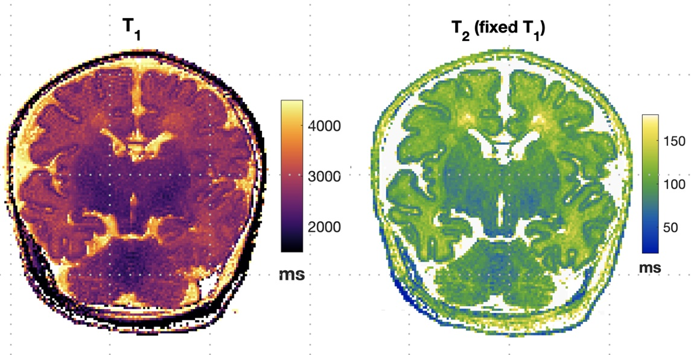

# 7T-neonate-t1-t2-mapping

Reconstruction of T1 &amp; T2 maps plus analysis code for 7T neonatal quantitative MRI project. This code accompanies a paper submitted to Magnetic Resonance in Medicine, a link will be posted here if/when it is published.

### Dependencies
Matlab toolboxes:
* Statistics and Machine Learning Toolbox, 
* Curve Fitting Toolbox

Colour maps were generated using ['colorcet'](https://colorcet.com/download/index.html): a set of perceptually uniform colour maps. The function has been bundled in with this repo, but please be aware of the license terms for colorcet, which are included in the header of function `lib/colorcet.m`. The maps are based on the work of Peter Kovesi, please see this [arXiv pre-print](https://arxiv.org/abs/1509.03700) for more.

### Overview
The code and data included in this repository can be used to reconstruct T1  and T2 maps using single slice acquisition. T1 is mapped using inversion recovery prepared ssTSE and reconstructed using simple fitting to an analytic signal expression.  T2 is mapped using multi-echo TSE and reconstructed using dictionary lookup, in a similar approach to [Ben Eliezer et al](https://onlinelibrary.wiley.com/doi/full/10.1002/mrm.25156). 

This repository contains code and data for the following:

* Creation of dictionary and dictionary lookup function for T2 method
* T1 and T2 estimation on phantom data from MR images
* T1 and T2 estimation on one example neonate dataset from MR images
* All T1 and T2 maps plus image segmentations for labels
* Statistical analysis for T1 and T2

### Instructions for use
The /lib directory contains helper functions. Please also download the data file separately from here (**add link**) and store it in /bin.

The top level directory contains the following scripts:

* `dict_create.m` creates dictionaries for T2 estimation. It also contains code to reproduce Supporting Information figures in the paper
* `t1_map_phantom_example.m` and `t2_map_phantom_example.m` contain the whole fitting pipeline for data from a spherical agarose phantom 
* `neonate_example.m` estimates T1 and T2 for one example neonate dataset
* `montage_maps.m` loads and displays all maps for all infants
* `regression_analysis.m` replicates the statistical analysis presented in the paper

Note that scripts will produce figure outputs etc in the /outputs sub-directory

